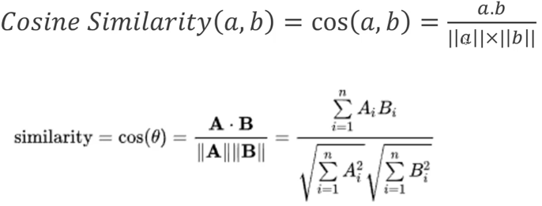

# Product Recommendation with Collaborative Filtering

## 1. Introduction

We have asked ourselves many times when shopping online, how do they know what we can buy? With this study we will try to understand the basics of 
recommendation systems. Aim is to defining two functions at the end, which recommends a product to the customer. One of them will be customer based 
and the other one will be item based.

## 2. Data

This is a transnational data set from [kaggle](https://www.kaggle.com/carrie1/ecommerce-data) which contains transactions mostly from wholesalers.

Field descriptions are below;

- InvoiceNo: Unique number of the invoice 
- StockCode: Unique code of the product 
- Description: Name of the product 
- Quantity: The amount of the purchase 
- InvoiceDate: Date of the invoice 
- UnitPrice: Cost per product 
- CustomerID: Unique ID of the customer 
- Country: Location of the customer 

## 3. Modelling

This model will be built on the **collaborative filtering** algorithm, which tries to answer the question; Do we have users that buy similar items? Let's 
say our system has records that we have a subset of users, who bought Metallica albums and most of these customers also bought Megadeath albums, too. 
Therefore, we can infer if someone purchases Metallica albums, they are also a likely candidate to purchase a Megadeath album. As can be seen from this 
example, that algorithm is used to recommend products based on the history of user behaviors and consequently looks at the similarites between users with 
a so called **user-to-item matrix**.

In user-to-item matrix, each row represents an individual customer and each column represents items in the inventory. In this case, 1 indicates that the 
customer purchased the relevant product, while 0 indicates the opposite. From this matrix, the similarity of customers will be calculated by 
using **cosine similarity** method to measure distance between customers. Cosine similarity measures the similarity between two vectors by the cosine 
of the angle between them and determines whether two vectors are pointing in roughly the same direction.

- A and B are used to represent two customers.
- Ai and Bi represent each item customer A and B purchased.

### 3.1 Customer Based

Customer-item matrix will be used to get the pairwise cosine similarity. To define that function below steps should be followed;

1. Choose a customer randomly
2. Find out which customer is the second(because first one is himself) most similar with the choosen one 
3. Answer the question; What items did the similar one buy, but the choosen one didn't?
4. Recommend those items to choosen one, since they're so similar.

### 3.2 Item Based

Transpose of customer-item matrix will be used to get the pairwise cosine similarity so called item similarity matrix, which will be used as a basis 
of the recommendation system. So item similarity matrix shows the items that were purchased together. For example a customer who buy suit will tend to 
buy leather shoes or other matching accessories. Therefore a black suit is going to score very high with black shoes. To define that function 
below steps should be followed;

1. Choose an item randomly.
2. Find out top 10 similar items with the choosen one (except itself).
3. Get the descriptions of these items while removing duplicates.

## 4. Conclusion